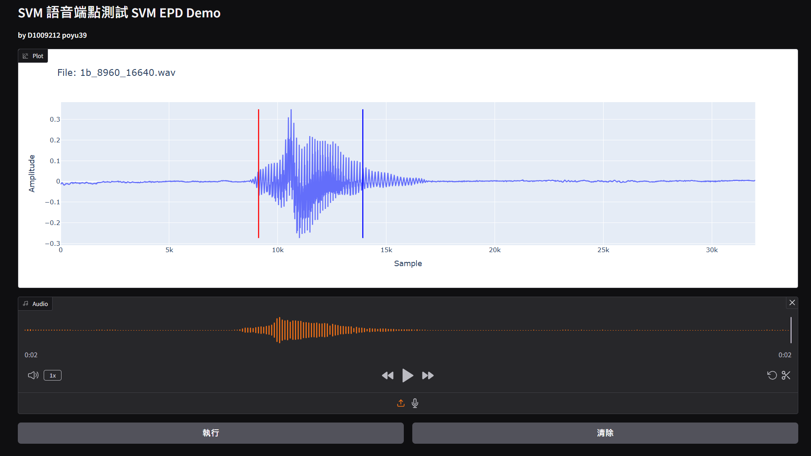

# 🎙️ SVM Speech Endpoint Detection (EPD)

> [README_ZH.md](./README_ZH.md)

## 📁 Folder Structure
```
hw03
├── data                        # 📚 Dataset
│   ├── dataset_cache.pt        # 🚀 Cached preprocessed dataset
│   ├── wavefiles-2008
│   ├── wavefiles-ex
│   └── wavefiles-all
├── models                      # 💻 Model output folder
│   └── 20250309_151313         # 📅 Training timestamp
│       ├── svm_model.pth       # 📦 Model file
│       ├── test.log
│       └── train.log
└── src                         # 🧩 Source code
    ├── config.py
    ├── dataset.py
    ├── epd.py
    ├── model.py
    ├── test.py
    └── train.py
```

## 🛠️ Environment

> python `3.11.5`, cuda `12.4`
```bash
pip install torch torchvision torchaudio --index-url https://download.pytorch.org/whl/cu124
pip install -r requirements.txt
```

## 🧷 Usage

```bash
# Training
python src/train.py

# Test Frame Scores
python src/test.py --model <model_path>

# Test EPD Scores
python src/epd.py --model <model_path> --score true --dataset <audio_folder>

# Visualization
python src/epd.py --model <model_path>
```

## ⚙️ Preprocessing

File naming convention: `<letter>_<start_sample>_<end_sample>.wav`. The dataset is split into training and testing sets in an 8:2 ratio using `wavefiles-all`.

### ✂️ Frame Segmentation
Since SVM requires fixed-size input features, audio files are segmented into frames of a fixed size.

```
# 2008 dataset
frame_size = 400 samples
hop_size = 80 samples

# ex dataset
frame_size = 256 samples
hop_size = 128 samples
```

### 📐 Dimension Adjustment
After reading the file using `torchaudio.load()`, the dimension is `(1, num_samples)`.  
Using `unsqueeze(0)`, the dimension is expanded to `(1, 1, frame_size)`, which aligns with `torchaudio.transforms.MFCC` requirements.

### 🎚️ MFCC Feature Extraction
`n_mfcc` is set to `13`, matching the model's input dimension, resulting in an output dimension of `(1, n_mfcc, num_frames)`.

### 🔍 Final Dimension Transformation
After removing the `batch` dimension, the final dimension is `(n_mfcc, num_frames)`.

## 🧠 SVM Model

SVM only accepts `2D` features, so `(n_mfcc, num_frames)` is flattened into `mean(n_mfcc)`, combined with labels to form `(mfcc, label)`.

Simulated using `nn.Linear`:

$$
f(x) = Wx + b
$$

## 📉 Loss Function (Hinge Loss)

$$
L = max(0, 1−y⋅f(x))
$$

When classification is correct (same sign), the loss is 0. When incorrect (different sign), the loss increases, guiding the model to learn boundaries.

## 🚀 Training Methodology

### 🎲 Stochastic Gradient Descent (SGD)
Training is performed using PyTorch’s built-in `SGD`, updating parameters `W` and `b`.

### 📉 Reduce Learning Rate
Using `torch.optim.lr_scheduler.ReduceLROnPlateau`, the learning rate is reduced when the loss does not improve for 3 consecutive epochs, reducing it to 0.5 times the original value.

### 🚧 Early Stopping
If there is no improvement for 5 consecutive epochs, training is stopped early.

## 📊 Output
```
model_timestamp
├── best_svm_model.pth  # 📦 Model file
├── config.yaml         # ⚙️ Configuration file
├── epd_score.csv       # 📊 Evaluation scores for detected audio files
├── test.log            # 📝 Evaluation scores based on the test set
└── train.log           # 📝 Training records
```

## 🎯 Validation

### 🎵 Frame Label Testing
Predictions are made based on MFCC features and labels of test frames, and accuracy is calculated.

✨ [Best Model](./models/best_model_ex/test.log) achieved an accuracy of `95.12%`.

### 🎼 End-point Sample Testing
Predictions are made based on the start and end samples of test audio files, and accuracy is calculated.

✨ [Best Model](./models/best_model_ex/epd_score.csv) achieved an accuracy of `90.29%`.

#### wavfiles-ex Test Results
```csv
Speaker,Correct,Total,EPD Score
123456_Zhehui,70.5,72,97.91666666666666
654321_Baiway,131.0,144,90.97222222222221
921510_Roger,163.0,180,90.55555555555556
921588_Leon,206.0,252,81.74603174603175
Average,0,0,90.29761904761904
```

## 📈 Visualization
Interactive visualization is implemented using Gradio + Plotly, allowing real-time audio file uploads for analysis, segment labeling, and playback.


