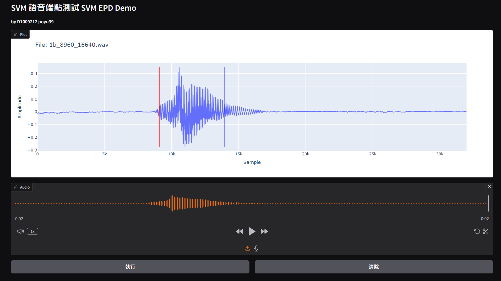

# 🎙️ SVM Voice Endpoint Detection (EPD)

> [README_ZH.md](README_ZH.md)

## 📁 Folder Structure
```
hw03
├── data                        # 📚 Dataset
│   ├── dataset_cache.pt        # 🚀 Preprocessed dataset cache
│   ├── waveFiles_2008
│   └── wavefiles-all
├── models                      # 🛠️ Model outputs
│   └── 20250309_151313         # 📅 Timestamp of training
│       ├── svm_model.pth       # 💾 Model file
│       ├── test.log
│       └── train.log
└── src
    ├── config.py
    ├── dataset.py
    ├── epd.py
    ├── model.py
    ├── test.py
    └── train.py
```

## 🛠️ Preprocessing

Files are named following `<letter>_<start sample>_<end sample>.wav`, and `wavefiles-all` is used to split data into training and testing sets with an 80/20 ratio.

### ✂️ 2.1. Frame Segmentation
Since SVM requires fixed-size inputs, audio files are segmented into fixed-size frames:

```
frame_size = 400 samples
hop_size = 80 samples
```

### 📐 2.2. Dimension Adjustment
After loading with `torchaudio.load()`, audio data initially has dimensions `(1, num_samples)`.
Since `torchaudio.transforms.MFCC` requires a `batch_size` dimension, `unsqueeze(0)` expands it to `(1, 1, frame_size)`.

### 🔄 2.3. MFCC Transformation
Set `n_mfcc` to `13`, synchronizing with the model's `input_dims`, resulting in dimensions `(1, n_mfcc, num_frames)`.

### 📏 2.4. Final Dimension Conversion
Remove the `batch` dimension, leaving dimensions as `(n_mfcc, num_frames)`.

## 🤖 3. SVM Model
SVM accepts only `1D` features, so `(13, 3)` is flattened to `(39,)` for input.

Implemented using `nn.Linear` to simulate:

$$
f(x) = Wx + b
$$

## 📉 4. Loss Function (Hinge Loss)

$$
L = max(0, 1 - y \cdot f(x))
$$

- Loss = 0 if `y` and `f(x)` have the same sign (correct classification).
- Loss increases when `y` and `f(x)` differ (incorrect classification), guiding the model to learn the boundary.

## 🚀 5. Training Method - SGD (Stochastic Gradient Descent)
Use PyTorch's built-in `SGD` to train and update parameters `W` and `b`.

## 📈 6. Training Log
Training details logged, including epoch and loss information, with final model stored as `svm_model.pth`.

## 🧪 7. Testing
Testing accuracy reached **91.87%** 🎯.

## 📊 8. Visualization
Interactive visualization with Gradio and Plotly allows real-time audio file uploads, analysis, segment marking, and playback.



